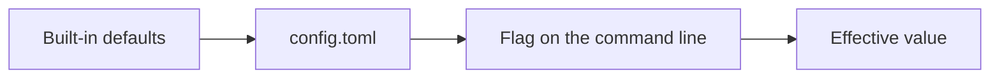

# Configuration

Every flag `login`, `mount`, and `tray` accept also has a key in a TOML config file at
`$XDG_CONFIG_HOME/proton-drive-fs/config.toml` (falls back to
`~/.config/proton-drive-fs/config.toml`), or wherever `-config <path>` points instead.
`status` also reads it for `mountpoint` when none is given on the command line.

## Precedence

Values resolve in one direction only: a flag passed on the command line always wins
over the config file, and the config file always wins over the built-in default.



## config init and config show

```
proton-drive-fs config init [-config path] [-force]
proton-drive-fs config show [-config path] [flags...]
```

`config init` writes a fully commented config file with every key at its default value
and a one-line explanation; uncomment a line to set it. It refuses to overwrite an
existing file unless `-force` is passed.

`config show` prints the effective configuration after merging defaults, the file, and
any flag passed to `config show` itself, with a trailing comment naming where each
value came from (`default`, `file`, or `flag`): useful to check what `mount` or `login`
would actually resolve to before running them.

## Keys

| Key | Flag | Default | Meaning |
| --- | --- | --- | --- |
| `mountpoint` | (positional for `mount`, `-mountpoint` for `tray`) | (none) | Default mountpoint `mount` and `tray` use when none is given on the command line. |
| `ttl` | `-ttl` | `30s` | How long a directory listing stays cached before it is fetched again. |
| `poll` | `-poll` | `10s` | How often the event feed is polled for remote changes. |
| `op_timeout` | `-op-timeout` | `60s` | Deadline for one filesystem operation's network calls. |
| `cache_dir` | `-cache-dir` | `$XDG_CACHE_HOME/proton-drive-fs` | Where downloaded file blocks and persisted directory listings are stored on disk. |
| `cache_size` | `-cache-size` | `2GiB` | Total size the on-disk cache (blocks and listings together) may use; `"0"` disables both. |
| `large_file` | `-large-file` | `300MiB` | Files larger than this bypass the on-disk block cache; `"0"` disables the threshold. |
| `thumbnails` | `-thumbnails` | `true` | Write Proton's stored previews into the freedesktop thumbnail cache. |
| `thumbnail_dir` | `-thumbnail-dir` | `$XDG_CACHE_HOME/thumbnails` | Freedesktop thumbnail cache directory. |
| `deny_readers` | `-deny-readers` | see [Usage](usage.md#mount) | Process names refused a read of a file above `large_file`; empty allows all. |
| `max_uploads` | `-max-uploads` | `5` | How many files upload at once. |
| `max_downloads` | `-max-downloads` | `8` | How many file blocks download at once. |
| `log_level` | `-log-level` | `info` | Log verbosity: `debug`, `info`, `warn`, or `error`. |
| `log_stderr` | `-log-stderr` | `false` | Force logging to stderr instead of the systemd journal. |
| `foreground` | `-foreground` | `false` | Stay attached to the terminal instead of detaching into the background. |
| `hv_method` | `-hv-method` | (none) | Force a human verification method at login: `captcha`, `email`, or `sms`. |
| `no_browser` | `-no-browser` | `false` | Do not open a browser for human verification at login. |

See [Usage](usage.md) for the full description of each flag.

## Cache directory

The persisted listing cache stores decrypted file and folder names on disk (under
`cache_dir/listings/`, mode 0600) so a folder listed once loads instantly on the next
cold start, the same trade-off the session file already makes for the account
password. It shares `cache_size`'s byte budget with the block cache (under
`cache_dir/blocks/`); set `cache_size = "0"` to disable both. See
[Where things live](troubleshooting.md#where-things-live) for the exact paths and
[Logs](troubleshooting.md#logs) for cache hit and miss log levels.
