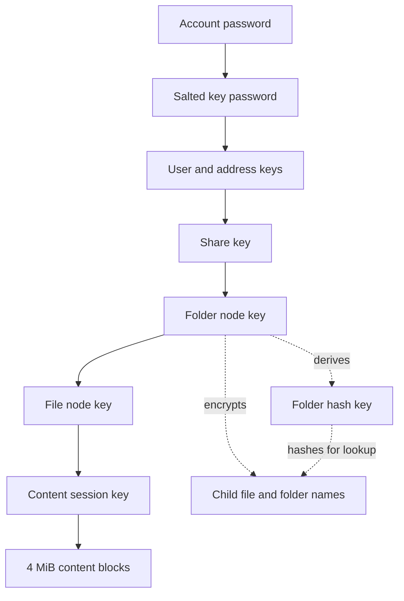
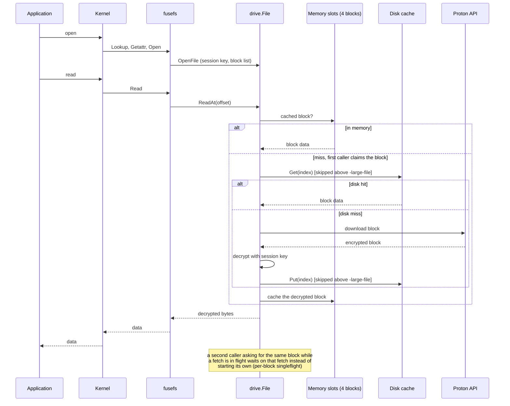
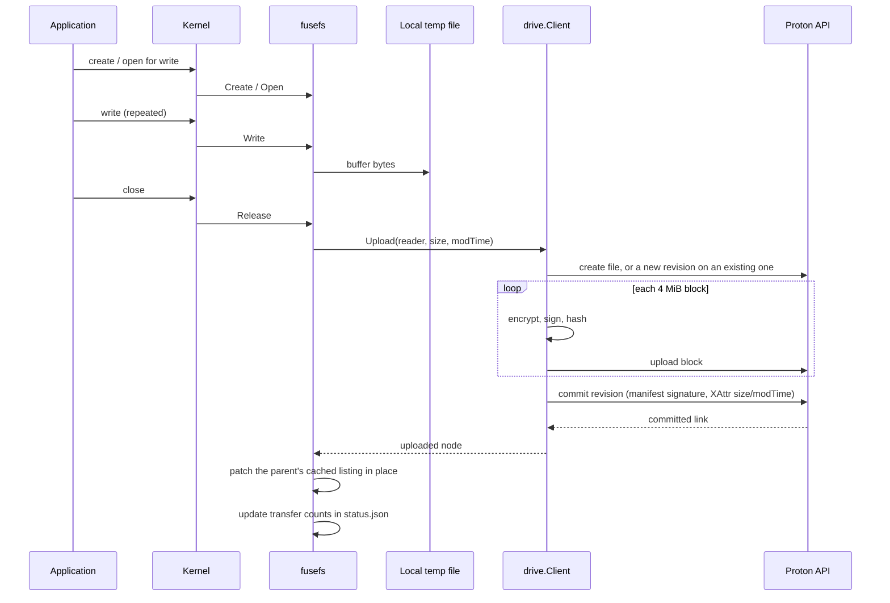
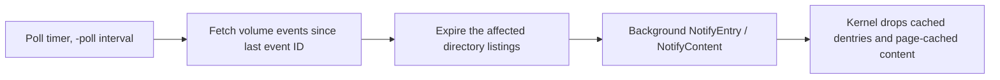
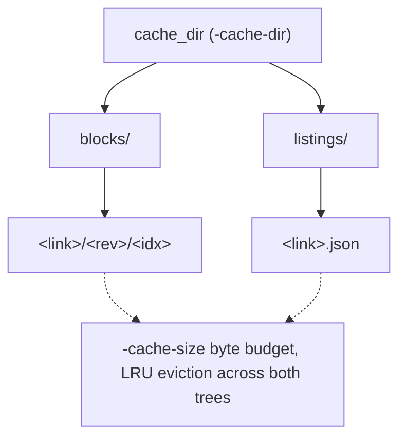

# How it works

## Architecture

proton-drive-fs is a single daemon built from three layers, plus a persistent-cache and
event-driven-sync design that keeps the mount in step with Proton without copying the
whole drive locally. The diagrams below walk through the encryption key chain, the read
and write paths, how remote changes propagate, and how the on-disk cache is laid out.

## Three layers

**Auth.** Logs in against Proton's API, handling two-factor codes and human
verification challenges. It derives the account's key password from the login
password and Proton's stored salts, then persists everything needed to restore the
session, including that key password, to the local session file or the OS keyring.

**Drive.** Wraps Proton's Drive API into a tree of nodes (files and folders), exposing
operations to list children, open a file for streamed reading, upload a new revision,
create a folder, move, and trash. Every file and folder name and every byte of file
content is end-to-end encrypted with the account's keys; the drive layer decrypts on
the way in and encrypts on the way out. It also polls Proton's event feed and turns
raw events into a normalized stream the FUSE layer reacts to.

**FUSE.** Publishes that tree as a mounted filesystem with go-fuse. Directory listings
are cached per folder for the configured TTL (`-ttl`) and refetched on expiry or on a
matching remote event.

### Encryption key chain

Every key in the chain below unlocks the next one; nothing past the account password
is ever written to disk unencrypted. Names are encrypted to their parent folder's node
key, and looked up by a hash computed with that folder's own hash key rather than by
the plaintext name.

## Reading a file

Opening a file for reading does not download it in full. The FUSE layer streams and
caches the file's content in fixed 4 MiB blocks, fetching only the blocks a read
actually touches. Reading the first few kilobytes of a large video, for example,
downloads one block, not the whole file.

Downloaded blocks are kept in an on-disk cache (`-cache-dir`, sized by `-cache-size`)
so a second read of the same block, even after a remount, does not cost another
download. Files larger than `-large-file` are still read block by block, but their
blocks skip the on-disk cache: one very large file streamed once should not push
everything else out of a cache sized for everyday use.

The sequence below follows one read from the application down to Proton's storage and
back, including where the large-file bypass applies and how concurrent reads of the
same block are deduplicated.

## Writing a file

Opening a file for writing buffers the new content to a local temp file. Nothing is
sent to Proton until the file closes, at which point the whole buffered file uploads
as a new revision. There is no partial write to the remote file and no streaming
upload while the file is still open.

The sequence below follows one write from the application's `close` through the
per-block upload to the committed revision, and how the parent directory's cached
listing is updated without a re-list.

## Staying in sync

The mount polls Proton's event feed on the interval set by `-poll`. Each event names
what changed remotely; the FUSE layer uses that to invalidate the affected directory
listing and any cached blocks for a changed file, so the next read or listing picks up
the current state instead of serving something stale. Pausing the tray's sync stops
this poll only; reads and writes you make locally keep working.

A directory's cached listing moves through the same states no matter what triggers a
fetch, and a burst of concurrent lookups against one directory shares a single fetch
instead of each starting its own.

```mermaid
stateDiagram-v2
    [*] --> Cold
    Cold --> ServedFromDisk: persisted listing found on disk
    Cold --> Refreshing: no persisted listing; first caller fetches
    ServedFromDisk --> Refreshing: background fetch starts immediately
    Refreshing --> Fresh: fetch succeeds
    Refreshing --> Expired: fetch fails, retried on the next call
    Fresh --> Expired: TTL elapses, or a remote event invalidates it
    Expired --> Refreshing: next Lookup or Readdir fetches again

    note right of Refreshing
        Concurrent callers wait on the same
        in-flight fetch instead of starting
        their own (singleflight)
    end note
```

## Cache layout

Blocks and persisted directory listings live under the same root and share one byte
budget, evicted least-recently-used by file modification time regardless of which
kind an entry is.

Files larger than `-large-file` never write into `blocks/` at all: their blocks are
still read lazily, block by block, but nothing from them touches disk, so one very
large file cannot evict everything else out of the cache.

## Previews

Proton stores a small thumbnail next to each file it has one for. When a folder is
listed, the mount downloads those thumbnails in the background and writes them into
the freedesktop thumbnail cache, the shared directory file managers read to show
previews without opening the files themselves.

## Reader denylist

Some desktops run thumbnailers and search indexers that open every file in a folder to
inspect it. On a network filesystem that means downloading a file's full content just
to generate a preview or index it. The processes named in `-deny-readers` are refused
a read of any file above `-large-file`; the open fails with a permission error and
nothing downloads. Applications a user launches by hand to open a file are not on the
list and are unaffected.
