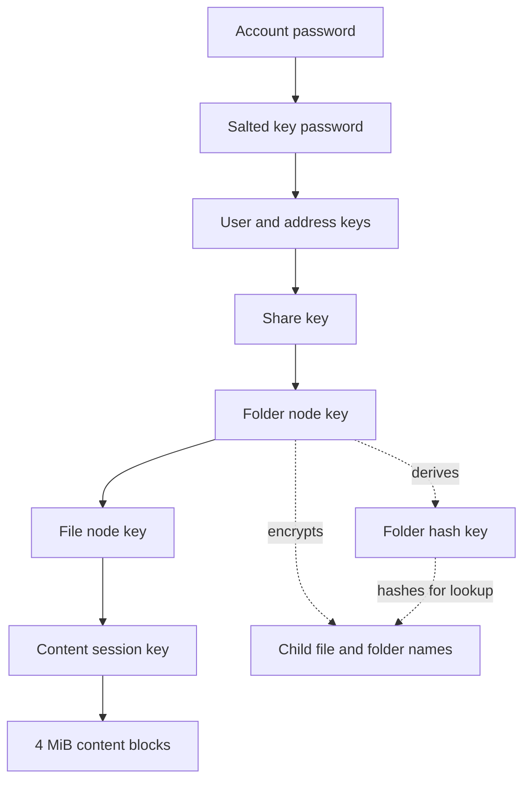
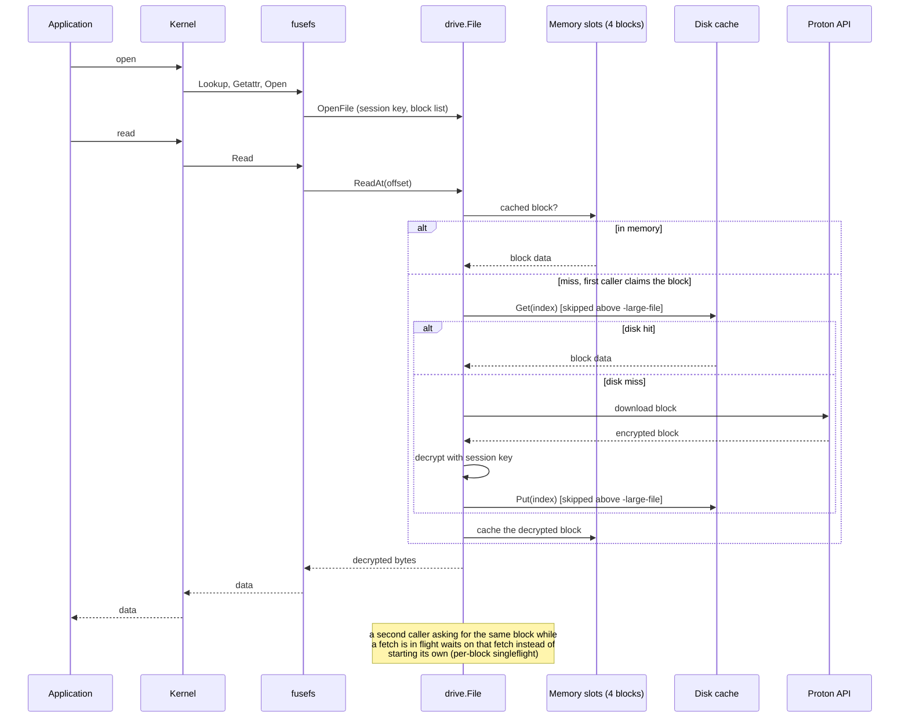
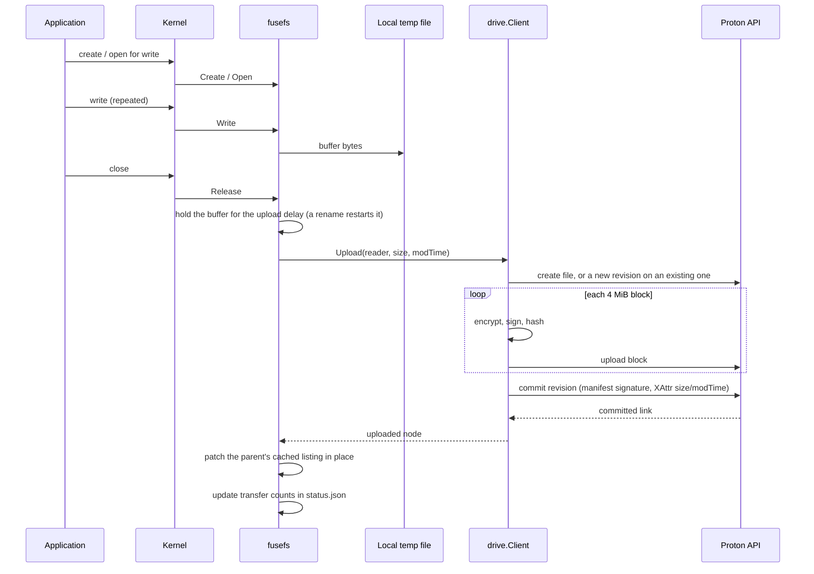
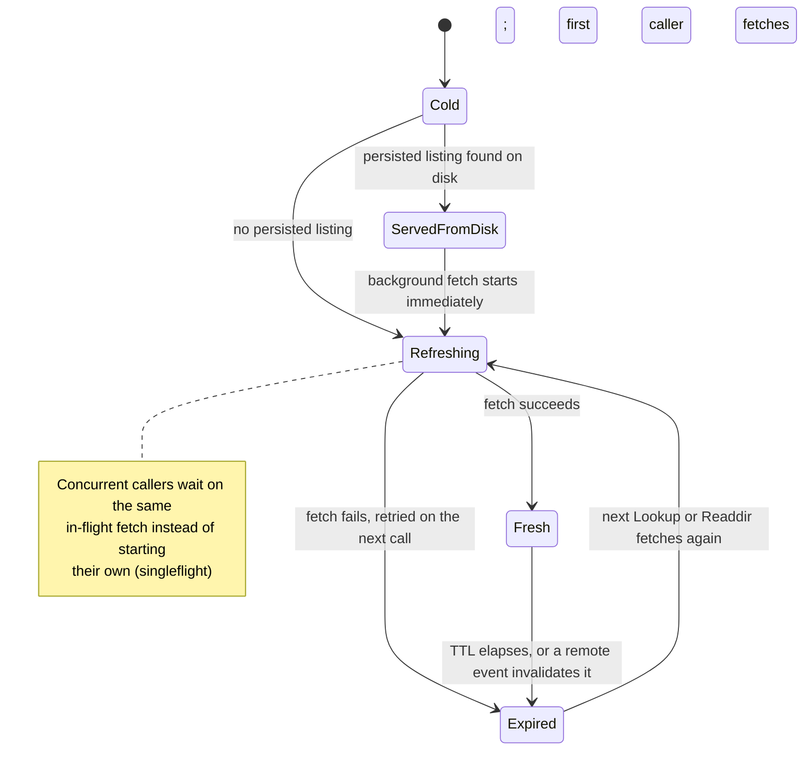
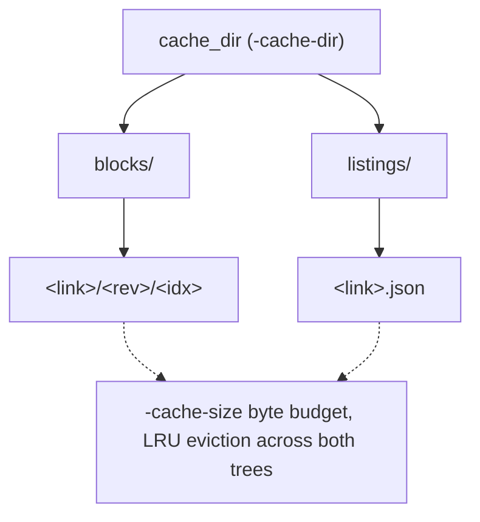

# How it works

## Architecture

proton-drive-fs is a single daemon made of three layers. It has a persistent cache and listens to Proton's events to keep the mount up to date, so we never need to copy your whole drive locally.

## Three layers

**Auth.** Logs you in against Proton's API, dealing with two-factor codes and human verification. It derives your key password from your login password and the salts Proton stores, then saves the session (check [login](usage.md#login) for where).

**Drive.** Wraps Proton's Drive API into a tree of files and folders that you can list, read, upload, create, move, and trash. Every name and every byte of content is end-to-end encrypted with your account keys, so this layer decrypts everything coming in and encrypts everything going out. It also polls Proton's event feed and turns the raw events into something the FUSE layer can react to.

**FUSE.** Shows that tree as a mounted filesystem using go-fuse. Each folder's listing is cached for the TTL you set (`-ttl`) and fetched again when it expires or when a remote event says it changed.

### Encryption key chain

Each key in this chain unlocks the next one, and nothing after your account password is ever written to disk unencrypted. Names are encrypted with the parent folder's node key, and we look them up by a hash made with that folder's hash key, so the plaintext name is never used for lookups.

```mermaid
flowchart TD
    Password["Account password"] --> KeyPass["Salted key password"]
    KeyPass --> UserKeys["User and address keys"]
    UserKeys --> ShareKey["Share key"]
    ShareKey --> FolderKey["Folder node key"]
    FolderKey --> FileKey["File node key"]
    FileKey --> SessionKey["Content session key"]
    SessionKey --> Blocks["4 MiB content blocks"]

    FolderKey -. encrypts .-> Names["Child file and folder names"]
    FolderKey -. derives .-> HashKey["Folder hash key"]
    HashKey -. hashes for lookup .-> Names
```

## Reading a file

Opening a file doesn't download the whole thing. We read the content in 4 MiB blocks and only fetch the blocks a read actually needs, so if you read the first few kilobytes of a huge video, we download one block.

Downloaded blocks go to an on-disk cache (`-cache-dir`, sized by `-cache-size`), so reading the same block again, even after a remount, doesn't download it again. Files bigger than `-large-file` skip that cache (check [Cache layout](#cache-layout)).

```mermaid
sequenceDiagram
    participant App as Application
    participant Kernel
    participant FS as fusefs
    participant Drive as drive.File
    participant Mem as Memory slots (4 blocks)
    participant Disk as Disk cache
    participant API as Proton API

    App->>Kernel: open
    Kernel->>FS: Lookup, Getattr, Open
    FS->>Drive: OpenFile (session key, block list)
    App->>Kernel: read
    Kernel->>FS: Read
    FS->>Drive: ReadAt(offset)
    Drive->>Mem: cached block?
    alt in memory
        Mem-->>Drive: block data
    else miss, first caller claims the block
        Drive->>Disk: Get(index) [skipped above -large-file]
        alt disk hit
            Disk-->>Drive: block data
        else disk miss
            Drive->>API: download block
            API-->>Drive: encrypted block
            Drive->>Drive: decrypt with session key
            Drive->>Disk: Put(index) [skipped above -large-file]
        end
        Drive->>Mem: cache the decrypted block
    end
    Drive-->>FS: decrypted bytes
    FS-->>Kernel: data
    Kernel-->>App: data

    Note over Drive: a second caller asking for the same block while<br/>a fetch is in flight waits on that fetch instead of<br/>starting its own (per-block singleflight)
```

## Writing a file

When you open a file for writing, everything goes to a local temp file and nothing is sent to Proton while it's open. When you close it, we wait for the upload delay (`-upload-delay`, `5s` by default, and you can change it per pattern with `-upload-delays`), then upload the whole file as a new revision. There's no partial or streaming upload while the file is open.

The delay is there because a lot of apps save in several steps. FreeCAD, for example, writes `model.FCStd.<uuid>`, renames `model.FCStd` to a timestamped `.FCBak`, then renames the temp file to `model.FCStd`. While a file is waiting:

- **Rename**: the file moves to the new name and the wait starts over with that name's delay.
- **Open for writing**: the app gets the same buffer back and the wait stops. Closing it again starts the wait again.
- **Delete**: we drop the buffer and nothing is uploaded.
- **Listing, stat, read**: you see the file and its content normally, even though Proton doesn't have it yet.
- **Unmount**: we upload everything that's still waiting before the mount goes away.
- **Failed upload**: we keep the buffer and try again every 30 seconds. The log tells you where the temp file is, so you never lose a save because the network failed.

A file with a name in `-exclude` is kept the same way, just without a timer. It stays local until you rename it to something outside the list.

```mermaid
sequenceDiagram
    participant App as Application
    participant Kernel
    participant FS as fusefs
    participant Tmp as Local temp file
    participant Drive as drive.Client
    participant API as Proton API

    App->>Kernel: create / open for write
    Kernel->>FS: Create / Open
    App->>Kernel: write (repeated)
    Kernel->>FS: Write
    FS->>Tmp: buffer bytes
    App->>Kernel: close
    Kernel->>FS: Release
    FS->>FS: hold the buffer for the upload delay (a rename restarts it)
    FS->>Drive: Upload(reader, size, modTime)
    Drive->>API: create file, or a new revision on an existing one
    loop each 4 MiB block
        Drive->>Drive: encrypt, sign, hash
        Drive->>API: upload block
    end
    Drive->>API: commit revision (manifest signature, XAttr size/modTime)
    API-->>Drive: committed link
    Drive-->>FS: uploaded node
    FS->>FS: patch the parent's cached listing in place
    FS->>FS: update transfer counts in status.json
```

## Staying in sync

We poll Proton's event feed every `-poll`. Each event says what changed on the remote side, and we throw away the cached listing of that folder and any cached blocks of a changed file, so the next read or listing gets the current version. You can pause this poll from the tray (check [Pause semantics](tray.md#pause-semantics)).

A folder's cached listing always goes through the same states, no matter what started the fetch. If a bunch of lookups hit the same folder at once, they all share one fetch.

```mermaid
stateDiagram-v2
    [*] --> Cold
    Cold --> ServedFromDisk: persisted listing found on disk
    Cold --> Refreshing: no persisted listing; first caller fetches
    ServedFromDisk --> Refreshing: background fetch starts immediately
    Refreshing --> Fresh: fetch succeeds
    Refreshing --> Expired: fetch fails, retried on the next call
    Fresh --> Expired: TTL elapses, or a remote event invalidates it
    Expired --> Refreshing: next Lookup or Readdir fetches again

    note right of Refreshing
        Concurrent callers wait on the same
        in-flight fetch instead of starting
        their own (singleflight)
    end note
```

## Cache layout

Blocks and listings live under the same root and share one size budget. When it's full, we delete whatever was used least recently, going by file modification time.

```mermaid
flowchart TD
    Root["cache_dir (-cache-dir)"] --> Blocks["blocks/"]
    Root --> Listings["listings/"]
    Blocks --> BlockPath["&lt;link&gt;/&lt;rev&gt;/&lt;idx&gt;"]
    Listings --> ListingPath["&lt;link&gt;.json"]

    Budget["-cache-size byte budget, LRU eviction across both trees"]
    BlockPath -.-> Budget
    ListingPath -.-> Budget
```

Files bigger than `-large-file` never write anything to `blocks/`. We still read them block by block, but nothing goes to disk, so one huge file can't push everything else out of the cache.

## Previews

When you list a folder, we write preview images into the freedesktop thumbnail cache, so your file manager shows thumbnails without opening the files.

We get thumbnails from two places, in this order:

1. **Proton's stored previews.** Proton keeps a small thumbnail for common file types (images, PDFs, documents). We download these in the background and write them to the cache.
2. **System thumbnailers.** For file types Proton has no preview for, we look for thumbnailer programs registered in `.thumbnailer` files under `/usr/share/thumbnailers`, `/usr/local/share/thumbnailers`, and `~/.local/share/thumbnailers` (that's the freedesktop thumbnailer spec). If one of them handles the file's MIME type, we download the file to a temp location, run the thumbnailer on it, and write the result to the cache. Files bigger than `-large-file` are skipped.

Since we generate thumbnails ourselves, thumbnailer processes are always blocked from reading through the mount, no matter the file size. Otherwise they'd do the same work twice and time out reading remote files through FUSE.

## Reader denylist

Some desktops run search indexers that open every file in a folder to look inside it. On a network filesystem, that means downloading the whole file just to index it. So the processes in `-deny-readers` can't read any file bigger than `-large-file`: the open fails with a permission error and nothing is downloaded. The apps you open files with yourself aren't on that list, so they work normally.

Thumbnailers are blocked too, at any file size (check [Previews](#previews)).
