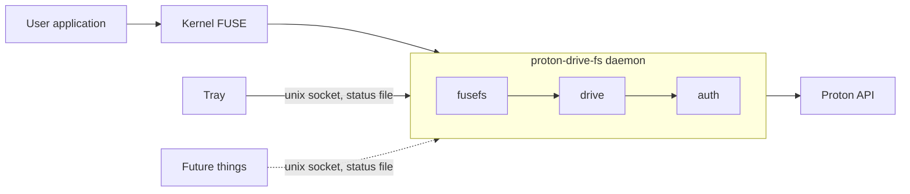

# proton-drive-linux-fs

A FUSE virtual filesystem that mounts Proton Drive as a local folder on Linux.

## What it does

This package mounts your Proton Drive at a directory you choose. Files and folders are
listed from Proton's metadata; the file download only happens when something opens
it.

Remote changes reach the mount through Proton's event feed, which invalidates the
affected directory listings and cached file content. Writes are buffered to a local
temp file and uploaded to Proton in full when the file closes.

## Status

Early and unofficial. Not affiliated with, endorsed by, or supported by Proton AG. The
tested surface is small: basic read, write, create, delete, rename and move operations
on one Proton Drive share. Expect bugs. Report them on the
[issue tracker](https://github.com/khaosdoctor/proton-drive-linux-fs/issues).

## Quick start

See [Quick start](quickstart.md) for a complete copy-paste flow, whether you installed
a package, run the systemd user units, or use the container image.

## Components

A user application never talks to Proton directly; every read and write goes through the
kernel's FUSE layer to the mount daemon, which is the only piece that speaks to Proton's
API.

The tray, and any future developments (probably a GUI), talk to that same daemon over its local unix socket, falling back to a status file when the socket is not available.

