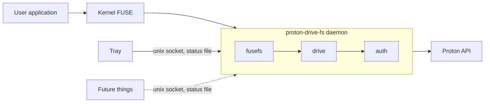

# proton-drive-linux-fs

> A FUSE virtual filesystem that mounts Proton Drive as a local folder on Linux.

## What it does

This package mounts your Proton Drive at a directory you choose. All the files and folders are listed from Proton's metadata directly. But we also don't download the file content from all your files either, instead the files are downloaded on demand when you read them. This is a "lazy" approach that saves bandwidth and disk space. Like Google Drive, Dropbox, OneDrive, etc.

Remote changes reach the mount through Proton's event feed, which invalidates the affected directory listings and cached file content. Writes are buffered to a local temp file and uploaded to Proton in full a set timeout when the file closes.

## Status

This is early and unofficial. Not affiliated with, endorsed by, or supported by Proton AG.

I have tested the most common paths, like: read, write, create, delete, rename and move operations on one Proton Drive share. But everyone has a different setup, and I can't test them all.

Expect bugs. Report them on the [issue tracker](https://github.com/khaosdoctor/proton-drive-linux-fs/issues).

## Quick start

See [Quick start](quickstart.md) for a complete copy-paste flow.

## Components

Your apps don't talk directly to proton. Reads and writes go through the kernel's FUSE layer to the mount daemon, which is the only piece that speaks to Proton's API. So all the communication is locked in this layer to avoid leaks of your credentials or data.

The tray, and any future developments (probably a GUI), talk to that same daemon over its local unix socket, falling back to a status file when the socket is not available. Ideally, it will __stay working no matter what happens__.

```mermaid
flowchart LR
    App["User application"] --> Kernel["Kernel FUSE"]
    Kernel --> Daemon

    subgraph Daemon["proton-drive-fs daemon"]
        direction LR
        FS["fusefs"] --> Drive["drive"] --> Auth["auth"]
    end

    Daemon --> API["Proton API"]

    Tray["Tray"] -->|"unix socket, status file"| Daemon
    GUI["Future things"] -.->|"unix socket, status file"| Daemon
```
