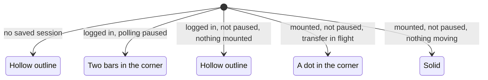
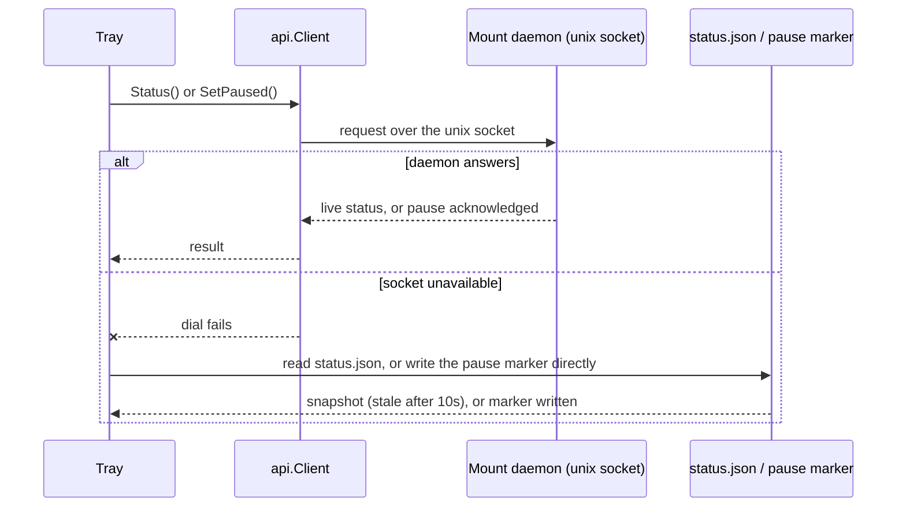

# Tray

```
proton-drive-fs tray [-mountpoint <path>]
```

Runs a status icon in the system tray over StatusNotifierItem, which is what Waybar,
KDE Plasma, and the GNOME AppIndicator extension speak. With no `-mountpoint` the tray
uses the config file's `mountpoint`, then the mountpoint it was given last time; the
choice is stored in `$XDG_CONFIG_HOME/proton-drive-fs/tray.json` so the menu keeps
working after a restart. There is no default mountpoint: with none of the three, the
tray still starts, but with mount management disabled until one is set (see
[No mountpoint configured](#no-mountpoint-configured)).

## Icon states

The icon is a cloud in one of four states, checked in this order:

1. **Hollow outline**: no saved session, or nothing mounted. The status line in the
   menu says which of the two it is.
2. **Two bars in the corner**: polling is paused.
3. **A dot in the corner**: a download or an upload is in flight.
4. **Solid**: mounted, logged in, nothing moving.

Each check short-circuits the next: being logged out hides everything else, a pause
marker outranks activity, and a transfer only counts while the mount's status snapshot
is fresh enough to trust.



While uploads are queued the status line counts them, as in
`Mounted at ~/ProtonDrive, syncing 312/10000`, and appends `, N failed` when some of
them could not be uploaded. The counts go back to zero half a minute after the queue
drains.

## Menu

The menu holds a status line (`Mounted at <path>`, `Not mounted`, `Not logged in`, or
`No mountpoint configured`), then items shown only when they apply:

- `Mount` when logged in, not mounted, and a mountpoint is configured.
- `Unmount` and `Restart mount` when mounted (which implies a mountpoint is
  configured).
- `Pause syncing` or `Resume syncing` when mounted.
- `Open folder` when mounted.
- `Open logs`.
- `Open config folder`.
- `Log in` when logged out.
- `Log out` when logged in.
- `Quit`.

## No mountpoint configured

When neither `-mountpoint`, the config file, nor the mountpoint remembered from a
previous run resolves to a path, the tray still starts rather than exiting: the status
line reads `No mountpoint configured`, and `Mount`, `Unmount`, `Restart mount`,
`Pause syncing`/`Resume syncing`, and `Open folder` stay hidden, since none of them has
a mountpoint to act on. `About`, `Open logs`, `Open config folder`,
`Log in`/`Log out`, and `Quit` stay available. Fix it with `Open config folder` followed
by an edit to `config.toml` setting `mountpoint`, or by restarting the tray with
`-mountpoint <path>`.

`Mount` and `Unmount` run this same binary, so a mount started from the menu is the
same detached mount you get from a shell. `Quit` unmounts the daemon before closing
the icon; Ctrl-C and SIGTERM do the same.

When the status line gets a ` (daemon X, restart needed)` suffix, the running daemon
is an older build than the tray itself, usually because a rebuild's earlier unmount
failed as busy. Click `Restart mount` to unmount and remount with the current binary.

`Log in` needs a terminal because it prompts for the password. The tray starts the
first terminal it finds on `PATH`, trying `$TERMINAL` first and then
`x-terminal-emulator`, `kitty`, `alacritty`, `foot`, `gnome-terminal`, `konsole`,
`xterm`. When none of them is installed, the status line shows the command to run
yourself for ten seconds. `Open logs` follows the journal in a terminal when the mount
logs there, and otherwise opens the log file with `xdg-open`. `Open config folder`
opens the directory holding the `config.toml` the tray was started with, created at
startup when it was missing; see [Configuration](configuration.md).

## Pause semantics

Pause stops one thing: the poll of Proton's event feed. Remote changes stop reaching
the mount until you resume, while reads and writes keep working throughout. It is a
marker file at `$XDG_RUNTIME_DIR/proton-drive-fs/paused` (falling back to
`$XDG_STATE_HOME/proton-drive-fs/paused`) that the mount checks on every poll tick, so
it also applies to a mount the tray did not start.

For the syncing state the mount writes `$XDG_RUNTIME_DIR/proton-drive-fs/status.json`
(same fallback) once a second with its pid, version, and the number of transfers in
flight. A snapshot older than ten seconds counts as no mount running; whether the
filesystem is mounted always comes from `/proc/self/mounts` instead.

Reading the status and setting the pause marker both go through the same local API
first, falling back to the status file or the pause marker directly when no daemon
answers on the socket, for example an older build without the API.



## Waybar, KDE, and GNOME

- Waybar: add the `tray` module to `modules-right` and `"tray": {}` to the config.
- KDE Plasma: works with no setup.
- GNOME: needs the AppIndicator and KStatusNotifierItem Support extension. GNOME Shell
  has no tray of its own.

## Desktop entry

```
install -Dm644 contrib/proton-drive-fs.desktop ~/.local/share/applications/proton-drive-fs.desktop
install -Dm644 contrib/icons/proton-drive-fs.png ~/.local/share/icons/hicolor/64x64/apps/proton-drive-fs.png
```

`make install` does both of these for you.

## Tray unit

To start the tray with the graphical session instead of by hand, use the
`proton-drive-fs-tray.service` user unit described in [Usage](usage.md#systemd-user-units).

## Restart-needed hint

The tray and the mount daemon are separate processes and can end up on different
binary versions after a rebuild, most often when an earlier unmount failed as busy and
left the old daemon running. The status line's ` (daemon X, restart needed)` suffix and
the `Restart mount` menu item exist for exactly this case: they unmount the stale
daemon and mount again with the binary currently on disk.
