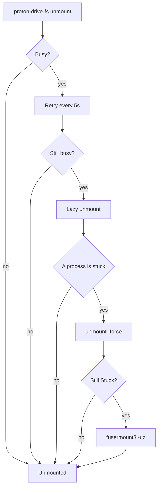

# Troubleshooting

## CAPTCHA during login

On first login, or after Proton grows suspicious of a login attempt, the API replies
with error 9001 (human verification required) instead of logging you in. `login`
catches this and walks you through it:

```bash
proton-drive-fs login
```

1. Proton lists the verification methods it offers (email, sms, captcha).
2. `login` tries email, then sms, then captcha, unless you forced one with
   `-hv-method`.
3. For a CAPTCHA, the CLI prints the verify.proton.me URL and opens it in a browser
   unless `-no-browser` is set, in which case open the URL yourself.
4. Solve the CAPTCHA in the browser, then press Enter in the terminal to continue.

## Account temporarily locked

Proton's API can return error 2028 (account temporarily locked) after several failed
login attempts in a row. This is enforced on Proton's side, not something
we can bypass. Wait before retrying because repeated retries while locked only
extend the wait.

## Mount or app refuses to start

One reason for that could be that PDFS only allows one instance of the mount per
user at a time. If you have another mount running, or something happened to the
previous mount and the daemon is still running, you will see an error when
trying to mount or start the tray. You can first try to check if the daemon is
running with:

```sh
ps -aux | grep proton-drive-fs
```

If not, this means a lockfile is still there preventing the mount from starting. You can remove it with:

```sh
rm -rf $XDG_RUNTIME_DIR/proton-drive-fs/mount.lock
```

Then __close the application completely__ and try to start it again.

## "Device or resource busy" on unmount

```bash
proton-drive-fs unmount path/to/mount
```

An unmount fails as busy while a process still has a file or the mountpoint open.
`unmount` retries automatically for `-wait` (default 5s), then falls back to a lazy
unmount that detaches the mount immediately and prints the processes still holding it
open so the kernel drops the mount once those processes let go.

If the daemon has died or deadlocked and programs are stuck on the mount instead of
just holding it open, use:

```bash
proton-drive-fs unmount -force path/to/mount
```

This lazily unmounts and aborts the kernel-side FUSE connection, so anything blocked
on the mount gets an error instead of hanging.

Sometimes both things will not work, in this case the solution is to pull the
plug with:

```bash
fusermount3 -uz path/to/mount
```

Here's the mental model you can follow:



## Stale daemon after a rebuild

Package upgrades (AUR, deb, rpm, apk) restart active services automatically, so this section applies only to source builds and manual installs.

If an earlier unmount failed as busy, the old daemon can keep serving a mountpoint
after you rebuild the binary. `mount` guards against this by refusing to attach to a
mountpoint that is already mounted and prints the running daemon's pid and version. Check what is
actually running with:

```sh
proton-drive-fs status path/to/mount
```

`status` reports a version mismatch between the running daemon and the current binary
and prints the unmount-then-mount command to fix it. `make restart` does the
same if you're building from source:

```sh
make restart
```

## systemd unit fails, or the tray shows "No mountpoint configured"

`systemctl --user status proton-drive-fs` shows the unit exiting right away, or the
tray's status line reads `No mountpoint configured` with `Mount`, `Unmount`, and the
other mount-management items hidden from its menu. This means that the
mountpoint is not recognized.

The package doesn't assume any default mountpoint, it will __require__ you to
set it.

Check if you set `mountpoint` in the config file, which any command already created for you at
`$XDG_CONFIG_HOME/proton-drive-fs/config.toml` or `~/.config/proton-drive-fs/config.toml`.

You can use the config command to open the folder, or click the tray icon:

```sh
proton-drive-fs config show
```

Reload and restart the unit, or quit and relaunch the tray:

```bash
systemctl --user daemon-reload
systemctl --user restart proton-drive-fs
```

## Indexer spam

If you have applications that resemble Alfred/Raycast/Spotlight in Linux, for
example: wofi, rofi, vicinae, etc. These things have indexers that will prevent
your mount from being unmounted forever.

A file indexer that walks the mount opens every file and directory under it, and each open turns into a metadata request over the network. When the mount is stalled or rate limited, the indexer's worker threads block in uninterruptible sleep until that request finishes.

If you have Proton Drive mounted at your root `/` (for example `/mnt/Proton`), a launcher's file indexer with home-directory indexing turned on, will walk the mount, and its worker threads may stay blocked for minutes, with `readdir "/" timed out after 1m0s` in the daemon's log at the same time.

> __Note:__ This can happen in basically any directory if your indexer has it
> enabled

### Choosing the mountpoint

Where to put it a mountpoint is a choice made at mount time. A
path outside the home directory root, for example `~/mnt/protondrive`, is walked by
fewer indexers than a directory placed directly under the home directory. But
this is convention, it _doesn't prevent it from happening_.

### The mount's own denylist

The mount blocks processes in two tiers:

- **Thumbnailer processes** (discovered from `.thumbnailer` files in `/usr/share/thumbnailers` and friends) are always blocked from reading through the mount, regardless of file size. The mount generates thumbnails itself by downloading the file and running the thumbnailer in-process, so letting them read through FUSE would be duplicate work and cause timeouts.
- **Indexer processes** named in `-deny-readers` (see [mount](usage.md#mount) for the default list) are blocked from reading files above `-large-file`. Add a process name to `-deny-readers` to extend that list.

If you prefer to deny that in the indexer itself, here's a non-exhaustive list.

### Some common indexers and how to exclude them

- **GNOME Tracker** (`tracker-miner-fs`, `tracker-extract`, `localsearch`): By default Tracker only indexes the folders listed in the `index-recursive-directories` gsettings key under `org.freedesktop.Tracker3.Miner.Files`. Any mountpoint outside those folders is already skipped. If it ends up covered anyway, remove it from `index-recursive-directories`, or add its name to `ignored-directories`:

  ```bash
  gsettings set org.freedesktop.Tracker3.Miner.Files ignored-directories "['protondrive']"
  ```

    Or, you can write an empty `.trackerignore` file at the top of the mountpoint before mounting. Then, restart the miner for a change to take effect: `tracker3 daemon -k`.

- **KDE Baloo** (`baloo_file`, `baloo_file_extractor`):

  ```sh
  balooctl6 config add excludeFolders path/to/mount
  ```

    Restart Baloo for the change to take effect: `balooctl6 disable && balooctl6 enable` (`balooctl` on Plasma 5).

- **Thumbnailer daemon** (`tumblerd`): `tumbler.rc` excludes are set per plugin. Copy `/etc/xdg/tumbler/tumbler.rc` to `~/.config/tumbler/tumbler.rc` if you do not have one yet, then add the mountpoint to `Excludes` (paths separated with `;`) under each `[...Thumbnailer]` section you care about, for example:

  ```
  [FfmpegThumbnailer]
  Excludes=~/mnt/protondrive
  ```

  The mount already blocks all thumbnailer processes (including `tumblerd`) from reading through FUSE and generates thumbnails itself, so this is only needed if you want to prevent `tumblerd` from even attempting to access the mount.

- **`updatedb`/`mlocate`/`plocate`**: Add the mountpoint to `PRUNEPATHS`, or add
  `fuse.proton-drive-fs` to `PRUNEFS`, in `/etc/updatedb.conf`:

  ```sh
  PRUNEPATHS="... /home/you/mnt/protondrive"
  PRUNEFS="... fuse.proton-drive-fs"
  ```

  `updatedb` reads this file on its next scheduled run (a daily cron job or systemd
  timer on most distributions), so you gotta wait.

- **vicinae**: Walks files under the home directory only when `search_files_in_root` is turned on in `~/.config/vicinae/settings.json` (`false` by default). Turn it off, or keep the mountpoint outside the home directory there's really no other alternative here:

  ```json
  "search_files_in_root": false
  ```

  vicinae picks up a config file change without a restart.

### Checking the filesystem type

`updatedb`'s `PRUNEFS`, and any other tool that excludes by filesystem type rather than by path, should match `fuse.proton-drive-fs`:

```sh
findmnt -t fuse.proton-drive-fs
```

To find the options

## systemd unit fails with status=203/EXEC

`systemctl --user status proton-drive-fs` shows the process exiting immediately with `status=203/EXEC`, then `Start request repeated too quickly` and `Failed with result 'start-limit-hit'`. This means the unit points at a binary that is not there, for example a stale unit left over from an older install after you switched install methods.

Check what the unit actually points at:

```sh
systemctl --user cat proton-drive-fs
```

Look at the `ExecStart=` line and confirm that path exists. Where the binary and the unit end up depends on how you installed:

- A package (AUR, deb, rpm, apk) puts the binary at `/usr/bin/proton-drive-fs` and the units at `/usr/lib/systemd/user/`.
- `make install` puts the binary at `$PREFIX/bin/proton-drive-fs` (default `~/.local/bin`) and the units at `~/.config/systemd/user/`, which also takes priority over the package copy.

A leftover unit in `~/.config/systemd/user/` from a previous `make install` can override the package's unit and still point at a binary you removed. Delete the stale one, or reinstall with the method you actually want, then reload and clear the failure:

```sh
systemctl --user daemon-reload
systemctl --user reset-failed proton-drive-fs
systemctl --user restart proton-drive-fs
```

## Read the logs

The mount daemon logs entries to the systemd user journal under the identifier `proton-drive-fs`, asynchronously.

`info` covers one line per event (mounting and unmounting, opening a file, etc); `debug` adds the details behind those (block-level cache hits and misses, and other nerd info). You can set `-log-level` on `mount` to one of `debug`, `info`, `warn`, or `error` (default `info`).

> __Important__: File contents or sensitive tokens/sessions are never logged.

Read the log with:

```sh
journalctl --user -t proton-drive-fs -f
journalctl --user -t proton-drive-fs -p debug -f
journalctl --user -t proton-drive-fs -o verbose -n 20
```

`-p debug` follows at debug level and above, picking up the technical fields. `-o verbose` shows every field on a log line as a journal field, uppercased with dots turned into underscores (`op` becomes `OP`, `cache.hit` becomes `CACHE_HIT`).

If your distro comes without a systemd journal to write to, or with `-log-stderr`, the daemon falls back to plain text on stderr which, for a detached mount, goes to `$XDG_STATE_HOME/proton-drive-fs/mount.log` falling back to `~/.local/state/proton-drive-fs/mount.log`. `-log-stderr` forces this fallback even when the journal is available, which is handy with `-foreground` at a terminal to debug stuff.

## General table of locations

| What | Path |
|---|---|
| Session (tokens, username, key password fallback) | `$XDG_CONFIG_HOME/proton-drive-fs/session.json` |
| Tray's remembered mountpoint | `$XDG_CONFIG_HOME/proton-drive-fs/tray.json` |
| On-disk block cache | `$XDG_CACHE_HOME/proton-drive-fs/blocks` (`-cache-dir`) |
| Thumbnails | `$XDG_CACHE_HOME/thumbnails` (`-thumbnail-dir`) |
| Mount log  | `$XDG_STATE_HOME/proton-drive-fs/mount.log` |
| Status snapshot (pid, version, transfers) | `$XDG_RUNTIME_DIR/proton-drive-fs/status.json` |
| Pause marker | `$XDG_RUNTIME_DIR/proton-drive-fs/paused` |
| Lockfile | `$XDG_RUNTIME_DIR/proton-drive-fs/mount.lock` |

Every `$XDG_*_HOME` path falls back to the matching directory under `$HOME` (for example `~/.config`, `~/.cache`, `~/.local/state`) when the environment variable is unset.
