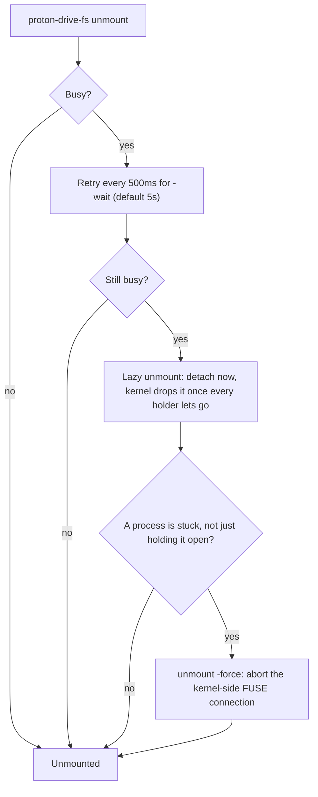
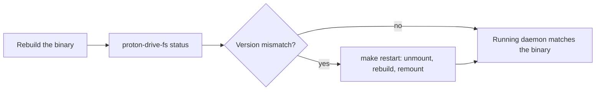

# Troubleshooting

## CAPTCHA during login

On first login, or after Proton grows suspicious of a login attempt, the API replies
with error 9001 (human verification required) instead of logging you in. `login`
catches this and walks you through it:

```
proton-drive-fs login
```

1. Proton lists the verification methods it offers (email, sms, captcha).
2. `login` tries email, then sms, then captcha, unless you forced one with
   `-hv-method`.
3. For a CAPTCHA, the CLI prints the verify.proton.me URL and opens it in a browser
   unless `-no-browser` is set, in which case open the URL yourself.
4. Solve the CAPTCHA in the browser, then press Enter in the terminal to continue.

## Account temporarily locked

Proton's API can return error 2028 (account temporarily locked) after several failed
login attempts in a row. This is enforced on Proton's side, not something
proton-drive-fs can bypass. Wait before retrying; repeated retries while locked only
extend the wait.

## "Device or resource busy" on unmount

```
proton-drive-fs unmount ~/ProtonDrive
```

A plain unmount fails as busy while a process still has a file or the mountpoint open.
`unmount` retries automatically for `-wait` (default 5s), then falls back to a lazy
unmount that detaches the mount immediately and prints the processes still holding it
open; the kernel drops the mount once those processes let go.

If the daemon has died or deadlocked and programs are stuck on the mount instead of
just holding it open, use:

```
proton-drive-fs unmount -force ~/ProtonDrive
```

This lazily unmounts and aborts the kernel-side FUSE connection, so anything blocked
on the mount gets an error instead of hanging. It needs no root for a mount you own.



## Stale daemon after a rebuild

If an earlier unmount failed as busy, the old daemon can keep serving a mountpoint
after you rebuild the binary. `mount` guards against this: it refuses to attach to a
mountpoint that is already mounted and prints the running daemon's pid and version, so
a rebuild is never mistaken for actually replacing what is running. Check what is
actually running with:

```
proton-drive-fs status ~/ProtonDrive
```

`status` reports a version mismatch between the running daemon and the current binary
and prints the exact unmount-then-mount command to fix it. `make restart` does the
same in one step:

```
make restart
```



## systemd unit fails, or the tray shows "No mountpoint configured"

`systemctl --user status proton-drive-fs` shows the unit exiting right away, or the
tray's status line reads `No mountpoint configured` with `Mount`, `Unmount`, and the
other mount-management items hidden from its menu. There is no default mountpoint:
`mount`, `unmount`, `status`, and the tray all need one from an argument,
`-mountpoint`, or the config file's `mountpoint` key, and the systemd unit has no
argument to give it at all.

Set `mountpoint` in the config file:

```
proton-drive-fs config init
```

then uncomment the `mountpoint` line and set it, and check what proton-drive-fs
actually resolved:

```
proton-drive-fs config show
```

Reload and restart the unit, or quit and relaunch the tray, once it is set:

```
systemctl --user daemon-reload
systemctl --user restart proton-drive-fs
```

## Keeping indexers out of the mount

A file indexer that walks the mount opens every file and directory under it, and each
open turns into a metadata request over the network. When the mount is stalled or rate
limited, the indexer's worker threads block in uninterruptible sleep until that request
finishes, rather than giving up on their own. On one machine running this project, a
launcher's file indexer had home-directory indexing turned on, walked the mount, and
its worker threads stayed blocked for minutes, with `readdir "/" timed out after 1m0s`
in the daemon's log at the same time.

### Choosing the mountpoint

There is no default mountpoint, so where to put it is a choice made at mount time. A
path outside the home directory root, for example `~/mnt/protondrive`, is walked by
fewer indexers than a directory placed directly under the home directory: several
indexers only walk a fixed set of well-known folders under `$HOME` (Desktop, Documents,
Downloads, Pictures, Videos) rather than the whole home tree.

### Excluding the mount per tool

- **GNOME Tracker** (`tracker-miner-fs`, `tracker-extract`, `localsearch`). By default
  Tracker only indexes the folders listed in the `index-recursive-directories`
  gsettings key under `org.freedesktop.Tracker3.Miner.Files`; a mountpoint outside
  those folders is already skipped. If it ends up covered anyway, remove it from
  `index-recursive-directories`, or add its name to `ignored-directories`:

  ```
  gsettings set org.freedesktop.Tracker3.Miner.Files ignored-directories "['protondrive']"
  ```

  or drop an empty `.trackerignore` file at the top of the mountpoint before mounting;
  Tracker skips any directory containing one of the names in
  `ignored-directories-with-content` (`.trackerignore`, `.git`, `.hg`, `.nomedia` by
  default). Restart the miner for a change to take effect: `tracker3 daemon -k`.

- **KDE Baloo** (`baloo_file`, `baloo_file_extractor`):

  ```
  balooctl6 config add excludeFolders ~/mnt/protondrive
  ```

  which appends the path to `exclude folders[$e]` under `[General]` in
  `~/.config/baloofilerc` (editing that key directly works the same way). Restart Baloo
  for the change to apply: `balooctl6 disable && balooctl6 enable` (`balooctl` on
  Plasma 5).

- **Thumbnailer daemon** (`tumblerd`). `tumbler.rc` excludes are set per plugin, not
  globally: copy `/etc/xdg/tumbler/tumbler.rc` to `~/.config/tumbler/tumbler.rc` if you
  do not have one yet, then add the mountpoint to `Excludes` (a `;`-separated path
  list) under each `[...Thumbnailer]` section you care about, for example:

  ```
  [FfmpegThumbnailer]
  Excludes=~/mnt/protondrive
  ```

  [The mount's own denylist](#the-mounts-own-denylist) already stops `tumblerd` from
  reading a large file on the mount, so this only matters if you also want it to skip
  small files there.

- **`updatedb`/`mlocate`/`plocate`**. Add the mountpoint to `PRUNEPATHS`, or add
  `fuse.proton-drive-fs` to `PRUNEFS`, in `/etc/updatedb.conf`:

  ```
  PRUNEPATHS="... /home/you/mnt/protondrive"
  PRUNEFS="... fuse.proton-drive-fs"
  ```

  `updatedb` reads this file on its next scheduled run (a daily cron job or systemd
  timer on most distributions); there is no daemon to restart.

- **vicinae**. Its root search walks files under the home directory only when
  `search_files_in_root` is turned on in `~/.config/vicinae/settings.json` (`false` by
  default). Turn it off, or keep the mountpoint outside the home directory so a
  home-rooted search never reaches it:

  ```
  "search_files_in_root": false
  ```

  vicinae picks up a config file change without a restart.

### The mount's own denylist

The mount already refuses a read of a file above `-large-file` from a fixed list of
thumbnailer and indexer process names (`-deny-readers`; see [mount](usage.md#mount) for
the current default list), so a preview for a large file on the mount comes from
Proton's own stored thumbnail instead of triggering a full download. Add a process name
to `-deny-readers` to extend that list.

### Checking the filesystem type

`updatedb`'s `PRUNEFS`, and any other tool that excludes by filesystem type rather than
by path, should match `fuse.proton-drive-fs`. See what is actually mounted with:

```
findmnt -t fuse.proton-drive-fs
```

## systemd unit fails with status=203/EXEC

`systemctl --user status proton-drive-fs` shows the process exiting immediately with
`status=203/EXEC`, then `Start request repeated too quickly` and
`Failed with result 'start-limit-hit'`. This means the unit points at a binary that is
not there, for example a stale unit left over from an older install after you switched
install methods.

Check what the unit actually points at:

```
systemctl --user cat proton-drive-fs
```

Look at the `ExecStart=` line and confirm that path exists. Where the binary and the
unit end up depends on how you installed:

- A package (AUR, deb, rpm, apk) puts the binary at `/usr/bin/proton-drive-fs` and the
  units at `/usr/lib/systemd/user/`.
- `make install` puts the binary at `$PREFIX/bin/proton-drive-fs` (default
  `~/.local/bin`) and the units at `~/.config/systemd/user/`, which also takes
  priority over the package copy.

A leftover unit in `~/.config/systemd/user/` from a previous `make install` can shadow
the package's unit and still point at a binary you removed. Delete the stale one, or
reinstall with the method you actually want, then reload and clear the failure:

```
systemctl --user daemon-reload
systemctl --user reset-failed proton-drive-fs
systemctl --user restart proton-drive-fs
```

## Logs

The mount daemon logs structured entries to the systemd user journal under the
identifier `proton-drive-fs`, asynchronously so a slow or backed-up log write never
stalls a filesystem operation.

Two levels matter day to day: `info` covers one line per event (mounting and
unmounting, opening a file, uploading, creating, renaming, moving, deleting, a remote
change applied, pause and resume, login and logout); `debug` adds the technical
fields behind those (block-level cache hits and misses, API call timing, listing page
counts, keyring unlocks, and more). `-log-level` on `mount` sets which of `debug`,
`info`, `warn`, or `error` gets logged (default `info`). Nothing here ever logs a
token, password, key material, or file content.

Read the log with:

```
journalctl --user -t proton-drive-fs -f
journalctl --user -t proton-drive-fs -p debug -f
journalctl --user -t proton-drive-fs -o verbose -n 20
```

`-p debug` follows at debug level and above, picking up the technical fields.
`-o verbose` shows every field on a log line (path, size, elapsed, err, and so on) as
a journal field, uppercased with dots turned into underscores (`op` becomes `OP`,
`cache.hit` becomes `CACHE_HIT`); the plain `journalctl` view hides them.

Without a systemd journal to write to, or with `-log-stderr`, the daemon falls back to
plain text on stderr, which for a detached mount goes to
`$XDG_STATE_HOME/proton-drive-fs/mount.log` (falling back to
`~/.local/state/proton-drive-fs/mount.log`). `-log-stderr` forces this fallback even
when the journal is available, which is handy with `-foreground` at a terminal.

## Where things live

| What | Path |
|---|---|
| Session (tokens, username, key password fallback) | `$XDG_CONFIG_HOME/proton-drive-fs/session.json` |
| Tray's remembered mountpoint | `$XDG_CONFIG_HOME/proton-drive-fs/tray.json` |
| On-disk block cache | `$XDG_CACHE_HOME/proton-drive-fs/blocks` (`-cache-dir`) |
| Thumbnails | `$XDG_CACHE_HOME/thumbnails` (`-thumbnail-dir`) |
| Mount log (no journal, or `-log-stderr`) | `$XDG_STATE_HOME/proton-drive-fs/mount.log` |
| Status snapshot (pid, version, transfers) | `$XDG_RUNTIME_DIR/proton-drive-fs/status.json` |
| Pause marker | `$XDG_RUNTIME_DIR/proton-drive-fs/paused` |

Every `$XDG_*_HOME` path falls back to the matching directory under `$HOME` (for
example `~/.config`, `~/.cache`, `~/.local/state`) when the environment variable is
unset.
