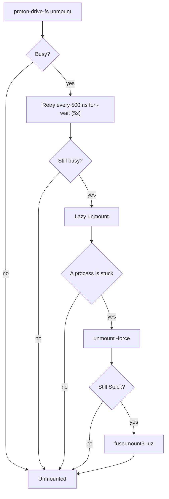

# Troubleshooting

## CAPTCHA during login

On your first login, or when Proton gets suspicious of a login, the API answers with error 9001 (human verification required) instead of logging you in. `login` handles this and walks you through it:

```bash
proton-drive-fs login
```

1. Proton tells us which verification methods it offers (email, sms, captcha).
2. We try email, then sms, then captcha, unless you picked one with `-hv-method`.
3. For a CAPTCHA, we print the verify.proton.me URL and open it in your browser. If you passed `-no-browser`, open the URL yourself.
4. Solve the CAPTCHA in the browser, then come back to the terminal and press Enter.

## Account temporarily locked

Proton's API can return error 2028 (account temporarily locked) after a few failed logins in a row. Proton does this on their side and we can't get around it. Just wait before trying again, because every retry while you're locked makes the wait longer.

## Mount or app refuses to start

One reason for that could be that PDFS only allows one instance of the mount per user at a time. If you have another mount running, or something happened to the previous mount and the daemon is still running, you will see an error when trying to mount or start the tray. You can first try to check if the daemon is running with:

```sh
ps -aux | grep proton-drive-fs
```

If not, this means a lockfile is still there preventing the mount from starting. You can remove it with:

```sh
rm -rf $XDG_RUNTIME_DIR/proton-drive-fs/mount.lock
```

Then __close the application completely__ and try to start it again.

## "Device or resource busy" on unmount

```bash
proton-drive-fs unmount path/to/mount
```

You get this when some process still has a file or the mountpoint itself open. `unmount` already retries for `-wait`, then does a lazy unmount and tells you which processes are still holding the mount (check [unmount](usage.md#unmount)).

If the daemon died or got stuck and your programs are hanging on the mount, use `-force`:

```bash
proton-drive-fs unmount -force path/to/mount
```

Sometimes both things will not work, in this case the solution is to go nuclear:

```bash
fusermount3 -uz path/to/mount
```

Here's the mental model you can follow:


```mermaid
flowchart TD
    Start["proton-drive-fs unmount"] --> Busy{"Busy?"}
    Busy -- no --> Done["Unmounted"]
    Busy -- yes --> Wait["Retry every 500ms for -wait (5s)"]
    Wait --> StillBusy{"Still busy?"}
    StillBusy -- no --> Done
    StillBusy -- yes --> Lazy["Lazy unmount"]
    Lazy --> Stuck{"A process is stuck"}
    Stuck -- yes --> Force["unmount -force"]
    Stuck -- no --> Done
    Force --> StillStuck{"Still Stuck?"}
    StillStuck -- yes --> Kill["fusermount3 -uz"]
    StillStuck -- no --> Done
    Kill --> Done
```

## Stale daemon after a rebuild

Package upgrades (AUR, deb, rpm, apk) restart the service for you, so this is only for source builds and manual installs.

If an unmount failed because the mount was busy, the old daemon can keep running after you rebuild the binary. `mount` won't attach to a mountpoint that's already mounted, and it prints the pid and version of the daemon that's running there. You can check what's actually running with:

```sh
proton-drive-fs status path/to/mount
```

If the running daemon and your binary have different versions, `status` tells you and prints the commands to unmount and mount again. If you're building from source, [make restart](usage.md#make-restart) does the same:

```sh
make restart MP=path/to/mount
```

## systemd unit fails, or the tray shows "No mountpoint configured"

If `systemctl --user status proton-drive-fs` shows the unit exiting right away, or the tray says `No mountpoint configured` and hides `Mount`, `Unmount` and the other mount items, we can't find your mountpoint. There's no default one, so you need to set it.

Check if you set `mountpoint` in the config file, which was already created for you at `$XDG_CONFIG_HOME/proton-drive-fs/config.toml` or `~/.config/proton-drive-fs/config.toml`. The tray's `Open config folder` opens that folder for you. `config show` prints the mountpoint we're using, or `unset` if there's none:

```sh
proton-drive-fs config show
```

Reload and restart the unit, or quit and relaunch the tray:

```bash
systemctl --user daemon-reload
systemctl --user restart proton-drive-fs
```

## Indexer spam

If you have applications that resemble Alfred/Raycast/Spotlight in Linux, for example: wofi, rofi, vicinae, etc. These things have indexers that will prevent your mount from being unmounted forever.

Their file indexers will open all the dirs and all the files within it and it will download everything from the web. When the mount is stalled or rate limited, the indexer's worker threads block in uninterruptible sleep until that request finishes.

If you have Proton Drive mounted at your root `/` (for example `/mnt/Proton`), a launcher with home directory indexing turned on will go through the whole mount, and it can stay stuck for minutes while the daemon logs `readdir "/" timed out after 1m0s`.

> __Note:__ This can happen in basically any directory if your indexer has it enabled

### Choosing the mountpoint

You pick where the mountpoint goes when you mount. Fewer indexers go through a path outside your home root, like `~/mnt/protondrive`, than a folder right under your home directory. But this is convention, it _doesn't prevent it from happening_.

### The mount's own denylist

The mount already blocks thumbnailers and the indexers named in `-deny-readers` from reading large files (see [Reader denylist](how-it-works.md#reader-denylist)). Add a process name to `-deny-readers` to extend that list.

If you prefer to deny that in the indexer itself, here's a non-exhaustive list.

### Some common indexers and how to exclude them

- **GNOME Tracker** (`tracker-miner-fs`, `tracker-extract`, `localsearch`): By default Tracker only indexes the folders in the `index-recursive-directories` gsettings key under `org.freedesktop.Tracker3.Miner.Files`, so a mountpoint outside them is already skipped. If yours is in there anyway, remove it from `index-recursive-directories`, or add its name to `ignored-directories`:

  ```bash
  gsettings set org.freedesktop.Tracker3.Miner.Files ignored-directories "['protondrive']"
  ```

    Or, you can write an empty `.trackerignore` file at the top of the mountpoint before mounting. Then, restart the miner for a change to take effect: `tracker3 daemon -k`.

- **KDE Baloo** (`baloo_file`, `baloo_file_extractor`):

  ```sh
  balooctl6 config add excludeFolders path/to/mount
  ```

    Restart Baloo for the change to take effect: `balooctl6 disable && balooctl6 enable` (`balooctl` on Plasma 5).

- **Thumbnailer daemon** (`tumblerd`): `tumbler.rc` excludes are per plugin. Copy `/etc/xdg/tumbler/tumbler.rc` to `~/.config/tumbler/tumbler.rc` if you don't have one yet, then add the mountpoint to `Excludes` (separate paths with `;`) under each `[...Thumbnailer]` section you care about, like this:

  ```
  [FfmpegThumbnailer]
  Excludes=~/mnt/protondrive
  ```

  The mount already refuses `tumblerd`'s reads, so this only stops it from trying.

- **`updatedb`/`mlocate`/`plocate`**: Add the mountpoint to `PRUNEPATHS`, or add `fuse.proton-drive-fs` to `PRUNEFS`, in `/etc/updatedb.conf`:

  ```sh
  PRUNEPATHS="... /home/you/mnt/protondrive"
  PRUNEFS="... fuse.proton-drive-fs"
  ```

  `updatedb` reads this file on its next scheduled run (a daily cron job or systemd timer on most distributions), so you gotta wait.

- **vicinae**: Walks files under the home directory only when `search_files_in_root` is turned on in `~/.config/vicinae/settings.json` (`false` by default). Turn it off, or keep the mountpoint outside the home directory there's really no other alternative here:

  ```json
  "search_files_in_root": false
  ```

  vicinae picks up a config file change without a restart.

### Checking the filesystem type

For `updatedb`'s `PRUNEFS`, or any other tool that excludes by filesystem type instead of path, use `fuse.proton-drive-fs`. You can see the mount with that type and its options with:

```sh
findmnt -t fuse.proton-drive-fs
```

## systemd unit fails with status=203/EXEC

If `systemctl --user status proton-drive-fs` shows the process exiting right away with `status=203/EXEC`, then `Start request repeated too quickly` and `Failed with result 'start-limit-hit'`, the unit is pointing at a binary that doesn't exist. This usually happens when an old unit is left over after you changed how you installed it.

Check what the unit is pointing at:

```sh
systemctl --user cat proton-drive-fs
```

Look at the `ExecStart=` line and see if that path exists. A package puts the binary at `/usr/bin/proton-drive-fs`, and `make install` puts it at `$PREFIX/bin/proton-drive-fs` (`~/.local/bin` by default). [autostart](usage.md#autostart) tells you where the unit file goes.

A unit in `~/.config/systemd/user/` wins over the package one, so a leftover from an old `make install` can still point at a binary you removed. Delete the old one, or reinstall the way you want, then reload and clear the failure:

```sh
systemctl --user daemon-reload
systemctl --user reset-failed proton-drive-fs
systemctl --user restart proton-drive-fs
```

## Read the logs

The mount daemon logs to the systemd user journal under the `proton-drive-fs` identifier.

`info` covers one line per event (mounting and unmounting, opening a file, etc); `debug` adds the details behind those (block-level cache hits and misses, and other nerd info). You can set `-log-level` on `mount` to one of `debug`, `info`, `warn`, or `error` (default `info`).

> __Important__: File contents or sensitive tokens/sessions are never logged.

Read the log with:

```sh
journalctl --user -t proton-drive-fs -f
journalctl --user -t proton-drive-fs -p debug -f
journalctl --user -t proton-drive-fs -o verbose -n 20
```

`-p debug` follows everything from debug up, so you get the technical fields. `-o verbose` shows every field of a log line as a journal field, in uppercase and with dots turned into underscores (`op` becomes `OP`, `cache.hit` becomes `CACHE_HIT`).

If your distro doesn't have a systemd journal, or you pass `-log-stderr`, the daemon logs plain text to stderr instead. For a detached mount, that goes to `$XDG_STATE_HOME/proton-drive-fs/mount.log` (or `~/.local/state/proton-drive-fs/mount.log`). `-log-stderr` does this even when the journal is there, which is handy with `-foreground` when you're debugging stuff in a terminal.

## General table of "where things are at"

| What | Path |
|---|---|
| Session (tokens, username, key password fallback) | `$XDG_CONFIG_HOME/proton-drive-fs/session.json` |
| Tray's remembered mountpoint | `$XDG_CONFIG_HOME/proton-drive-fs/tray.json` |
| On-disk block cache | `$XDG_CACHE_HOME/proton-drive-fs/blocks` (`-cache-dir`) |
| Thumbnails | `$XDG_CACHE_HOME/thumbnails` (`-thumbnail-dir`) |
| Mount log  | `$XDG_STATE_HOME/proton-drive-fs/mount.log` |
| Status snapshot (pid, version, transfers) | `$XDG_RUNTIME_DIR/proton-drive-fs/status.json` |
| Pause marker | `$XDG_RUNTIME_DIR/proton-drive-fs/paused` |
| Lockfile | `$XDG_RUNTIME_DIR/proton-drive-fs/mount.lock` |

If an `$XDG_*_HOME` variable isn't set, we use the matching directory under `$HOME` instead (`~/.config`, `~/.cache`, `~/.local/state`, and so on).
